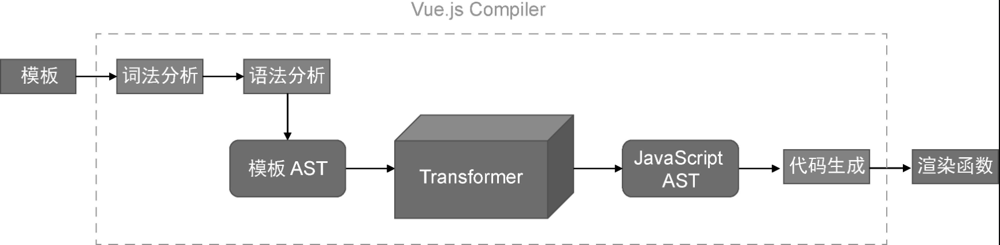
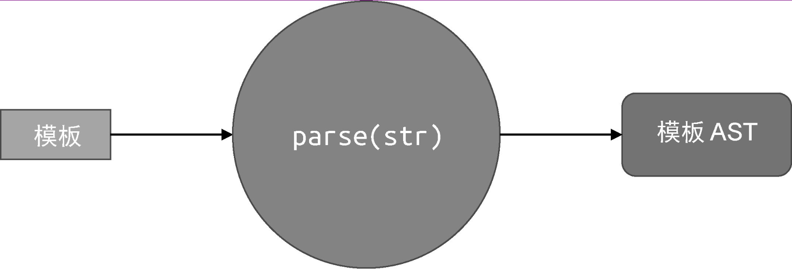
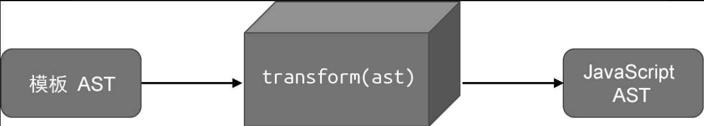
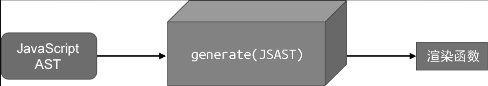
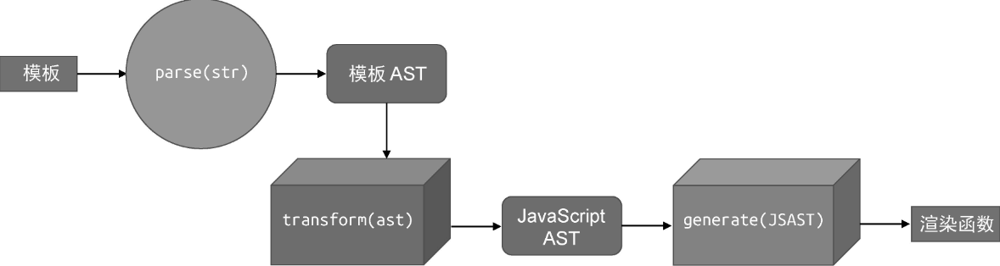

# 编译器核心技术概览

## 1. 模板 DSL 的编译器

编译器其实只是一段程序，它用来将“一种语言 A”翻译成“另外一种语言 B”。其中，语言 A 通常叫作源代码（source code），语言 B 通常叫作目标代码（object code 或 target code）。编译器将源代码翻译为目标代码的过程叫作编译（compile）。完整的编译过程通常包含词法分析、语法分析、语义分析、中间代码生成、优化、目标代码生成等步骤。

对于Vue.js 模板编译器来说，源代码就是组件的模板，而目标代码是能够在浏览器平台上运行的JavaScript 代码，或其他拥有 JavaScript 运行时的平台代码。

源代码：
```html
<div>
  <h1 :id="dynamicId"> Vue Template </h1>
</div>
```

目标代码：
```js
function render() {
  return h('div',[
    h('h1', {id: dynamicId}, 'Vue Template')
  ])
}
```

可以看到，Vue.js 模板编译器的目标代码其实就是渲染函数。详细而言，Vue.js 模板编译器会首先对模板进行词法分析和语法分析，得到模板 AST。接着，将模板 AST 转换（transform）成JavaScript AST。最后，根据 JavaScript AST 生成 JavaScript 代码，即渲染函数代码。



AST 是 abstract syntax tree 的首字母缩写，即抽象语法树。所谓模板 AST，其实就是用来描述模板的抽象语法树。

```html
<div>
  <h1 v-if="of"> Vue Template</h1>
</div>
```

上面的这段模板，会被编译成下面的 AST：

```js
const ast = {
  type: 'root',
  children: [
    {
      type: 'Element',
      tag: 'div',
      children: [
        {
          type: 'Element',
          tag: 'h1',
          props: [
            {
              type: 'Directive',
              name: 'if',
              exp: {
                type: "Expression",
                content: 'ok'
              }
            }
          ]
        }
      ]
    }
  ]
}
```

AST 其实就是一个具有层级结构的对象。模板 AST 具有与模板同构的嵌套结构。每一棵AST 都有一个逻辑上的根节点，其类型为 Root。模板中真正的根节点则作为 Root 节点的 children 存在。观察上面的 AST，我们可以得出如下结论。

- 不同类型的节点是通过节点的 type 属性进行区分的。例如标签节点的 type 值为 'Element'
- 标签节点的子节点存储在其 children 数组中
- 标签节点的属性节点和指令节点会存储在 props 数组中
- 不同类型的节点会使用不同的对象属性进行描述。例如指令节点拥有 name 属性，用来表达指令的名称，而表达式节点拥有 content 属性，用来描述表达式的内容

我们可以通过封装 parse 函数来完成对模板的词法分析和语法分析，得到模板 AST：



在语义分析的基础上，我们即可得到模板 AST。接着，我们还需要将模板 AST 转换为 JavaScript AST。因为 Vue.js 模板编译器的最终目标是生成渲染函数，而渲染函数本质上是 JavaScript 代码，所以我们需要将模板 AST 转换成用于描述渲染函数的 JavaScript AST。

我们可以封装 transform 函数来完成模板 AST 到 JavaScript AST 的转换工作：



有了 JavaScript AST 后，我们就可以根据它生成渲染函数了，这一步可以通过封装 generate 函数来完成：



在上面这段代码中，generate 函数会将渲染函数的代码以字符串的形式返回，并存储在 code 常量中：



## parser 的实现原理与状态机

Vue.js 模板编译器的基本结构和工作流程，它主要由三个部分组成：

- 用来将模板字符串解析为模板 AST 的解析器（parser）；
- 用来将模板 AST 转换为 JavaScript AST 的转换器（transformer）；
- 用来根据 JavaScript AST 生成渲染函数代码的生成器（generator）。

解析器的入参是字符串模板，解析器会逐个读取字符串模板中的字符，并根据一定的规则将整个字符串切割为一个个 Token。这里的 Token 可以视作词法记号，后续我们将使用 Token 一词来代表词法记号进行解释。例如：

```html
<p>Vue</p>
```

解析器会把这段字符串分为三个Token：

- 开始标签：`<p>`
- 文本节点：`Vue`
- 结束标签：`</p>`

tokenize 函数会模板解析得到三个 token：

```js
const tokens = tokenize(`<p>Vue</p>`)
// [
//   { type: 'tag', name: 'p' },        // 开始标签
//   { type: 'text', content: 'Vue' },  // 文本节点
//   { type: 'tagEnd', name: 'p' }      // 结束标签
// ]
```

## 构造 AST

```js
function parse(str) {
  // 首先将模板进行标记化，得到tokens
  const tokens = tokenize(str)

  // 创建根节点
  const root = {
    type: 'Root',
    children: []
  }

  // 创建 elementStack 栈，起初只读 root 根节点
  const elementStack = [root]

  while (tokens.length) {

    // 获取当前栈点的顶层节点作为父节点
    const parent = elementStack[elementStack.length - 1]

    // 扫描token
    const t = tokens[0]

    switch (t.type) {
      case 'tag':
        // 如果 token 是开始标签，则创建 Element 类型的 AST 节点
        const elementNode = {
          type: 'Element',
          tag: t.name,
          children: []
        }
        parent.children.push(elementNode)
        break
      case 'text':
        // 如果 token 是文本，则创建 Text 类型的 AST 节点
        const textNode = {
          type: 'Text',
          content: t.content
        }
        // 将其添加到父节点的 children 中
        parent.children.push(textNode)
        break
      case 'tarEnd':
        // 遇到结束标签，将栈顶节点弹出
        elementStack.pop()
        break
    }

    // 消费已经扫描过的 token
    tokens.shift()

  }

  return root
}

// 用来将模板str 转变为 tokes
function tokenize(str) {
  /* ... */
}

```

## AST 的转化与插件架构

所谓 AST 的转换，指的是对 AST 进行一系列操作，将其转换为新的 AST 的过程。新的 AST 可以是原语言或原DSL 的描述，也可以是其他语言或其他 DSL 的描述。例如，我们可以对模板 AST 进行操作，将其转换为 JavaScript AST。转换后的 AST 可以用于代码生成。这其实就是 Vue.js 的模板编译器将模板编译为渲染函数的过程。
